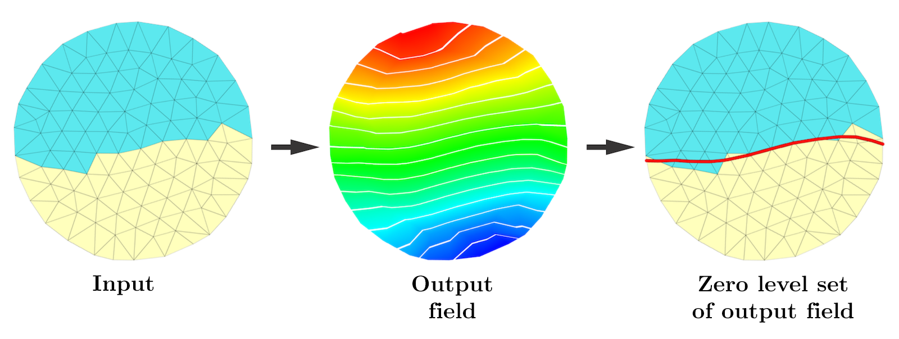

# Hyper Surfaces Smoothing
This is the reference implementation for the paper 

_A Heat Flow Based Relaxation Scheme for n Dimensional Discrete Hyper Surfaces_  
M. Livesu  
Computers &amp; Graphics (2018)  

### Downloading and compiling the code
Start by cloning the repository with:
```
git clone --recursive https://github.com/maxicino/HyperSurfaceSmoothing.git
```
External dependencies ([Eigen](http://eigen.tuxfamily.org) for numerics and [CinoLib](https://github.com/maxicino/cinolib) for geometry processing) are conveniently included in the package, so that you do not have to install them separately. All you have to do is to launch the script: 
```
./build.sh
```
which will take care of all the compilation burder. An executable file `hyper_surface_smoothing` will automatically appear in your newly created local `/bin` folder.

### Usage
The program reads a triangular mesh (both OBJ and OFF formats are supported) and a bipartition of it, represented by a text file having one line per triangle, valued either 0 or 1. A simple example is included in the `/data` folder, to run it:

```
./hyper_surface_smoothing ../data/circle.obj ..data/circle_labeling.txt
```

<p align="center"></p>
